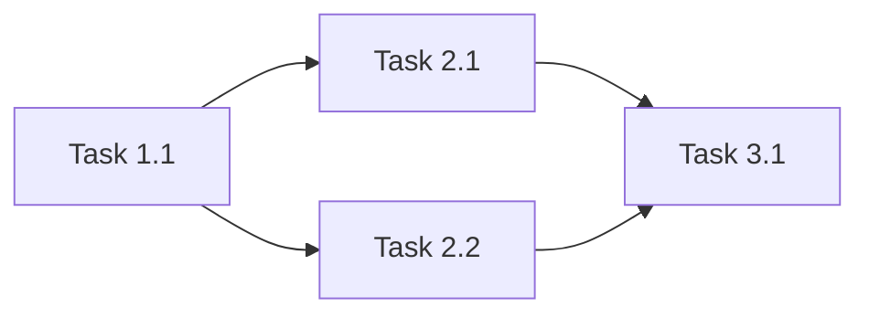

# /plan - Project Planning Mode

$ARGUMENTS: Feature or project description

---

## 🤖 Applied Agents: `project-planner`, `orchestrator` (Supreme Entity)

This workflow creates comprehensive project plans WITHOUT writing any code.

## 🧠 Supreme Entity Integration

When `/plan` is triggered, the Supreme Entity applies 5W1H:

| Dimension | Analysis |
|-----------|----------|
| **WHAT** | User needs structured task breakdown |
| **WHO** | `@project-planner` primary, Supreme Entity for agent assignment |
| **HOW** | `plan-writing`, `c4-architecture`, `brainstorming` skills |
| **WHY** | Prevent chaos, ensure systematic execution |

---

## 🔴 CRITICAL RULES

1. **NO CODE WRITING** — This command creates plan file ONLY
2. **Use project-planner agent** — NOT generic planning
3. **Socratic Gate** — Ask clarifying questions before planning
4. **Dynamic Naming** — Plan file named based on task
5. **Agent Assignment** — Every task gets an assigned agent

---

## 🛠️ Step-by-Step Execution

### Phase 0: Socratic Gate
Before planning, ask 2-3 clarifying questions:
- Scope (full app / module / feature)?
- Priority (speed / quality / security)?
- Constraints (timeline / tech / existing code)?

### Phase 1: Context Analysis
- Read existing PLAN.md files if any
- Analyze codebase structure
- Identify dependencies

### Phase 2: Task Breakdown
- Break down into atomic tasks
- Assign agents to each task
- Identify dependencies between tasks
- Estimate effort for each

### Phase 3: Plan Generation
- Create `docs/PLAN-{task-slug}.md`
- Include verification criteria
- Define success metrics

---

## 🚦 Output Format

```markdown
# PLAN: [Task Description]

## Overview
[Brief description of what will be built]

## Project Type: WEB | MOBILE | BACKEND | FULL_STACK

## Agent Team
| Agent | Responsibility |
|-------|----------------|
| @frontend-specialist | UI components |
| @backend-specialist | API endpoints |
| @test-engineer | Test coverage |

---

## Task Breakdown

### Phase 1: Foundation
- [ ] Task 1.1 — @agent — [Description] — Est: Xh
- [ ] Task 1.2 — @agent — [Description] — Est: Xh

### Phase 2: Core Features
- [ ] Task 2.1 — @agent — [Description] — Est: Xh
- [ ] Task 2.2 — @agent — [Description] — Est: Xh

### Phase 3: Integration
- [ ] Task 3.1 — @agent — [Description] — Est: Xh

### Phase 4: Verification
- [ ] Run tests — @test-engineer
- [ ] Security audit — @security-auditor
- [ ] Final review — @agent-perfectionist

---

## Dependencies


---

## Success Criteria
- [ ] All tests passing
- [ ] No critical security issues
- [ ] Performance targets met
- [ ] User acceptance verified

---

## Skill Requirements
| Skill | Purpose |
|-------|---------|
| react-best-practices | Component architecture |
| api-patterns | Endpoint design |
| testing-patterns | Test strategy |

---

## Estimated Timeline
| Phase | Duration |
|-------|----------|
| Foundation | X hours |
| Core | Y hours |
| Integration | Z hours |
| **Total** | **W hours** |
```

---

## Naming Convention

| Request | Plan File |
|---------|-----------|
| `/plan e-commerce cart` | `docs/PLAN-ecommerce-cart.md` |
| `/plan mobile fitness app` | `docs/PLAN-fitness-app.md` |
| `/plan dark mode feature` | `docs/PLAN-dark-mode.md` |
| `/plan SaaS dashboard` | `docs/PLAN-saas-dashboard.md` |

**Rules:**
- 2-3 key words from request
- Lowercase, hyphen-separated
- Max 30 characters

---

## 🔗 Workflow Chaining

| After Plan | Next Workflow |
|------------|---------------|
| Plan approved | `/create` or `/enhance` |
| Needs design | `/blueprint` first |
| Complex multi-domain | `/orchestrate` |

---

## Post-Planning Message

```markdown
✅ **Plan created:** `docs/PLAN-{slug}.md`

**Summary:**
- [X] tasks across [Y] phases
- Agents assigned: @agent1, @agent2, @agent3
- Estimated: [Z] hours

**Next steps:**
1. Review the plan
2. Run `/create` to start implementation
3. Or modify plan manually

Shall I proceed with implementation?
```

---

## Examples

```
/plan e-commerce site with cart
/plan mobile app for fitness tracking
/plan add dark mode feature
/plan fix authentication bug
/plan SaaS dashboard with analytics
```

---

## Key Principles

- **Plan before code** — Never skip planning for complex tasks
- **Agent ownership** — Every task has an assigned agent
- **Dependency-aware** — Order tasks logically
- **Verifiable** — Clear success criteria
- **Transparent estimates** — Honest effort predictions

## 🕸️ Spider Web Sync
- **Integrated Optimizations**: Apply `@[/poweruseage]` Level 3 + `@[/memory-optimization]`.
- **Related Triggers**: `/frontend-specialist`, `/backend-specialist`, `/security-auditor`, `/test-engineer`, `/performance-optimizer`, `/mobile-developer`, `/documentation-writer`, `/plan`.
