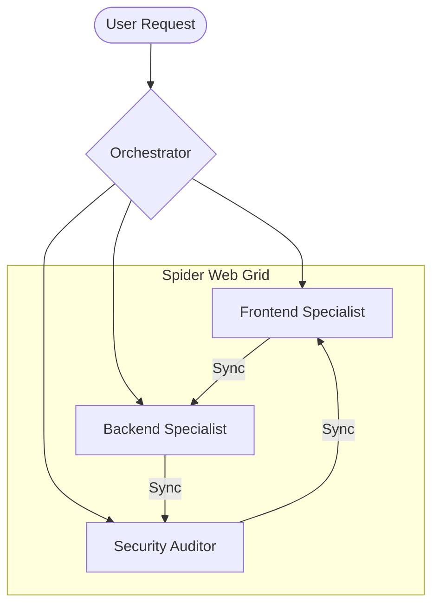
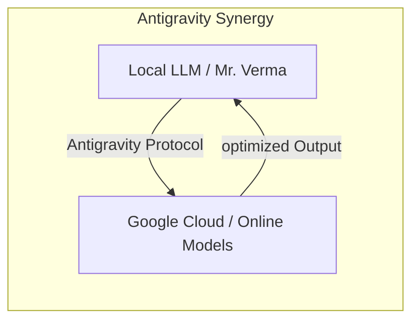

# Mr. Verma: The Ultimate AI Orchestration Guide
> *Mastering the Spider Web of Intelligence*

Welcome to the **Mr. Verma** ecosystem. This guide is designed for non-technical users to understand the power, philosophy, and practical use cases of the world's most advanced autonomous agent orchestration platform.

---

## 1. What is Mr. Verma?

Mr. Verma is not just a "chatbot" or a simple AI assistant. It is a **Synchronized Intelligence Grid**—a "Spider Web" of 28 specialist agents and 126 modular skills working in perfect harmony.

### How it Works (The Spider Web)
Imagine a massive control center where 28 specialized experts (Architects, Security Auditors, Product Managers, etc.) are all connected by a central brain. When you give a command, Mr. Verma automatically:
1. **Analyzes** your intent.
2. **Orchestrates** the right experts.
3. **Executes** the task with military precision.

---

## 2. The Power of "Vibecoding"

**Vibecoding** is the art of building complex systems using natural language and intent, rather than just writing lines of code. Mr. Verma masters this via a 5-step lifecycle:

| Step | Action | What it Does |
| :--- | :--- | :--- |
| **1. Analyze** | Intel Capture | Understands the "vibe" and constraints of your project. |
| **2. Enhance** | Logic Injection | Adds missing features and advanced capabilities automatically. |
| **3. Fine-tune** | Detail Polish | Refines the smaller details for a premium experience. This involves adjusting model parameters locally to match your specific coding style. |
| **4. Advance** | Scale Up | Prepares the system for high-load and complex interactions. It "Advances" the project by automatically generating documentation and scalability plans. |
| **5. Optimize** | Token Savings | Dramatically reduces costs while keeping quality at 100%. |

---

## 3. Local LLM + Online Models: The Synergy

One of Mr. Verma's most powerful features is how it balances **Local Intelligence** with **Online Clouds** (OpenAI, Gemini, Claude).

### The Guardian Model
The **Local LLM** (running on your machine) acts as the **Guardian**. It handles:
- **Privacy**: Your sensitive data stays local.
- **Optimization**: It "compresses" complex requests before sending them to expensive online models.
- **Speed**: Instant responses for system-level tasks.

### The Cloud Bridge: Google Antigravity Platform
The **Google Antigravity Platform** serves as the highway between your local machine and the global AI clouds. It provides:
- **Neural Routing**: Automatically selects the best model for the task (e.g., uses Claude for reasoning, Gemini for context width).
- **Latency Masking**: Performs local pre-computations so you never wait for "Cloud Thinking".
- **Advanced Orchestration**: Interconnects your Local LLM with Google's planetary-scale infrastructure for limitless power.

---

## 4. Poweruseage: High Quality, Low Weight

Mr. Verma uses a revolutionary technique called **Symbolic Density** (`/poweruseage`).

- **Traditional AI**: Writes long, verbose paragraphs that waste "tokens" (money).
- **Mr. Verma**: Uses symbolic notation (∴, ∵, →) and compressed logic to deliver **Identical Quality** but with a **70% smaller footprint**.

**Result**: You get the world's best AI performance without the world's highest bill.

---

## 5. Direct Use Cases

- **Autonomous Patching**: If your system breaks, Mr. Verma detects, diagnoses, and fixes it before you even notice.
- **Instant Blueprints**: Turn a one-sentence idea into a full technical architecture (C4 Diagrams).
- **Security Fortress**: Military-grade security sweeps on every line of code you generate.

---

> 🔴 **STATUS**: System Operational | Mode: **Harmony**
