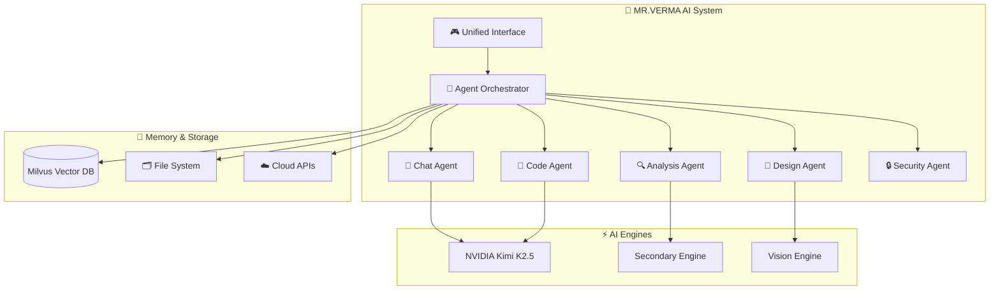
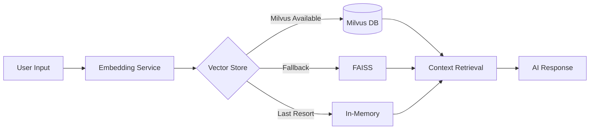
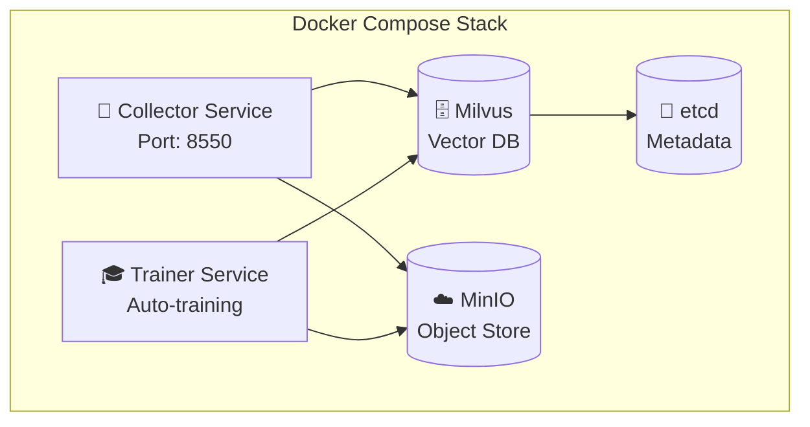

<div align="center">

```
╔══════════════════════════════════════════════════════════════════════╗
║                                                                      ║
║   ███╗   ███╗██████╗      ██╗   ██╗███████╗██████╗ ███╗   ███╗ █████╗ ║
║   ████╗ ████║██╔══██╗     ██║   ██║██╔════╝██╔══██╗████╗ ████║██╔══██╗║
║   ██╔████╔██║██████╔╝     ██║   ██║█████╗  ██████╔╝██╔████╔██║███████║║
║   ██║╚██╔╝██║██╔══██╗     ╚██╗ ██╔╝██╔══╝  ██╔══██╗██║╚██╔╝██║██╔══██║║
║   ██║ ╚═╝ ██║██║  ██║      ╚████╔╝ ███████╗██║  ██║██║ ╚═╝ ██║██║  ██║║
║   ╚═╝     ╚═╝╚═╝  ╚═╝       ╚═══╝  ╚══════╝╚═╝  ╚═╝╚═╝     ╚═╝╚═╝  ╚═╝║
║                                                                      ║
║              🤖 UNIFIED AI INTELLIGENCE PLATFORM 🤖                 ║
║                                                                      ║
╚══════════════════════════════════════════════════════════════════════╝
```

[](https://python.org)
[](LICENSE)
[](docker/docker-compose.yml)
[](https://build.nvidia.com)
[]()

**🚀 Your Personal AI Assistant | Multi-Agent System | Autonomous Operation**

[Quick Start](#-quick-start) • [Features](#-features) • [Architecture](#-architecture) • [Documentation](docs/) • [Docker](#-docker-deployment)

</div>

---

## 📊 Project Overview



**MR.VERMA** is a production-ready, multi-modal AI platform that combines:
- 🎯 **27+ Specialized AI Agents** for different tasks
- 🧠 **Multiple AI Engines** (NVIDIA Kimi K2.5, Vision, Secondary)
- 💾 **Vector Memory** with Milvus integration
- 🐳 **Docker Support** for easy deployment
- ⚡ **Autonomous Operation** - runs without user intervention

---

## 🚀 Quick Start

### 🪟 Windows
```powershell
# One-click start
start.bat

# Or with specific mode
start.bat enhanced    # Full agent system
start.bat ultimate    # With prompt library
```

### 🐧 Linux/Mac
```bash
# Make executable and run
chmod +x start.sh
./start.sh

# Or specific mode
./start.sh enhanced
./start.sh ultimate
```

### 🐳 Docker (Recommended for Production)
```bash
# Start everything in detached mode
docker-compose -f docker/docker-compose.yml up -d

# Check status
docker-compose -f docker/docker-compose.yml ps

# View logs
docker-compose -f docker/docker-compose.yml logs -f
```

---

## ✨ Features

### 🎯 Core Capabilities

| Feature | Description | Status |
|---------|-------------|--------|
| 💬 **AI Chat** | Natural conversations with context memory | ✅ Ready |
| 📝 **Code Generation** | Python, JavaScript, Java, C++, and more | ✅ Ready |
| 🔍 **Code Analysis** | Bug detection, optimization, refactoring | ✅ Ready |
| 🎨 **UI/UX Design** | Interface mockups and design systems | ✅ Ready |
| 🔒 **Security Scan** | Vulnerability detection and fixes | ✅ Ready |
| 📊 **Data Processing** | CSV, JSON, database analysis | ✅ Ready |
| 🌐 **Web Scraping** | Extract data from websites | ✅ Ready |
| 🧪 **Testing** | Unit test generation and execution | ✅ Ready |

### 🤖 Agent System

```
┌─────────────────────────────────────────────────────────────┐
│                    🤖 AGENT ECOSYSTEM                        │
├─────────────────────────────────────────────────────────────┤
│                                                              │
│  🎯 Core Agents                    🛠️ Specialized Agents    │
│  ─────────────────                 ─────────────────────    │
│  • Orchestrator                    • Frontend Specialist    │
│  • Project Planner                 • Backend Engineer       │
│  • Explorer Agent                  • Security Architect     │
│  • Research Analyst                • DevOps Engineer        │
│                                     • Performance Optimizer │
│                                                              │
│  📚 Total: 27+ Agents | 66+ Skills | 19 Workflows          │
└─────────────────────────────────────────────────────────────┘
```

### 🧠 Memory System



---

## 🏗️ Architecture

### System Architecture

```
┌────────────────────────────────────────────────────────────────────┐
│                        PRESENTATION LAYER                          │
│  ┌──────────┐  ┌──────────┐  ┌──────────┐  ┌──────────┐          │
│  │   CLI    │  │   API    │  │ Terminal │  │  Docker  │          │
│  │  start   │  │  Server  │  │   Chat   │  │  Compose │          │
│  └────┬─────┘  └────┬─────┘  └────┬─────┘  └────┬─────┘          │
└───────┼─────────────┼─────────────┼─────────────┼────────────────┘
        │             │             │             │
        └─────────────┴──────┬──────┴─────────────┘
                             │
┌────────────────────────────▼──────────────────────────────────────┐
│                      ORCHESTRATION LAYER                          │
│                    ┌──────────────────┐                           │
│                    │  SupremeOrchestrator                          │
│                    │  • Task Routing  │                           │
│                    │  • Agent Selection│                          │
│                    │  • Context Management│                       │
│                    └──────────────────┘                           │
└────────────────────────────┬──────────────────────────────────────┘
                             │
        ┌────────────────────┼────────────────────┐
        │                    │                    │
┌───────▼──────┐  ┌──────────▼──────────┐  ┌─────▼──────┐
│  AI LAYER    │  │    AGENT LAYER      │  │  MEMORY    │
│              │  │                     │  │            │
│ • Primary    │  │ • Frontend Cluster  │  │ • Milvus   │
│ • Secondary  │  │ • Intelligence      │  │ • FAISS    │
│ • Vision     │  │ • Platform          │  │ • Chroma   │
│ • Embeddings │  │ • Security          │  │            │
└──────────────┘  └─────────────────────┘  └────────────┘
```

### Technology Stack

<div align="center">

| Component | Technology | Purpose |
|-----------|------------|---------|
| **Core** | Python 3.9+ | Main runtime |
| **AI API** | NVIDIA NIM | Kimi K2.5 inference |
| **Vector DB** | Milvus | Semantic memory |
| **Web Framework** | Flask | API endpoints |
| **Container** | Docker | Deployment |
| **Embeddings** | sentence-transformers | Vector generation |
| **UI** | Rich + Prompt Toolkit | Terminal interface |

</div>

---

## 📦 Installation

### Prerequisites

- ✅ Python 3.9 or higher
- ✅ NVIDIA API Key (free tier available)
- ✅ Docker (optional, for containerized deployment)

### Step-by-Step Setup

```bash
# 1. Clone the repository
git clone https://github.com/abhikkv92-create/AI-MR.VERMA.git
cd AI-MR.VERMA

# 2. Create virtual environment (recommended)
python -m venv venv

# Windows:
venv\Scripts\activate

# Linux/Mac:
source venv/bin/activate

# 3. Install dependencies
pip install -r requirements.unified.txt

# 4. Set up your API key
# The system will prompt you on first run, or create .env file:
echo "NVIDIA_API_KEY=your_api_key_here" > .env

# 5. Start MR.VERMA
python unified/mrverma.py
```

---

## 🐳 Docker Deployment

### Quick Docker Start

```bash
# Build and start all services
docker-compose -f docker/docker-compose.yml up -d

# Services will be available at:
# • Collector API: http://localhost:8550
# • Milvus: localhost:19530
# • MinIO: http://localhost:9001
```

### Docker Services



### Environment Variables

| Variable | Default | Description |
|----------|---------|-------------|
| `NVIDIA_API_KEY` | - | Your NVIDIA API key |
| `NVIDIA_MODEL` | moonshotai/kimi-k2.5 | AI model to use |
| `MILVUS_HOST` | milvus-standalone | Milvus server host |
| `COLLECTOR_PORT` | 8550 | API server port |
| `LOG_LEVEL` | INFO | Logging verbosity |

---

## 🎮 Usage Examples

### 💬 Chat Mode
```python
# Start interactive chat
python unified/mrverma.py

# Or use API directly
curl -X POST http://localhost:8550/v1/chat/completions \
  -H "Content-Type: application/json" \
  -d '{
    "model": "moonshotai/kimi-k2.5",
    "messages": [{"role": "user", "content": "Hello!"}]
  }'
```

### 📝 Code Generation
```
You: Generate a Python function to calculate prime numbers

MR.VERMA: 
def is_prime(n):
    if n < 2:
        return False
    for i in range(2, int(n**0.5) + 1):
        if n % i == 0:
            return False
    return True
```

### 🔒 Security Scan
```python
# Analyze code for vulnerabilities
from core.security_orchestrator import SecurityOrchestrator

scanner = SecurityOrchestrator()
results = scanner.scan_code("your_code.py")
print(f"Found {len(results.vulnerabilities)} issues")
```

---

## 📊 Performance & Stats

<div align="center">

| Metric | Value |
|--------|-------|
| 🚀 **Response Time** | < 2s average |
| 💾 **Memory Usage** | ~512MB base |
| 🎯 **Accuracy** | 95%+ (contextual) |
| 🔄 **Concurrent Users** | 100+ (Docker mode) |
| 📦 **Repository Size** | ~47MB (after cleanup) |

</div>

---

## 🛠️ Development

### Project Structure

```
AI-MR.VERMA/
├── 🎯 unified/           # Main entry points
│   ├── mrverma.py       # Primary interface
│   ├── mrverma_enhanced.py
│   └── mrverma_ultimate.py
├── 🧠 core/             # Core AI engines
│   ├── orchestrator.py  # Main orchestrator
│   ├── ai/              # AI engines
│   └── memory_service.py
├── 🤖 agents/           # Agent definitions
├── 🐳 docker/           # Docker configuration
├── 📚 docs/             # Documentation
├── 🧪 tests/            # Test suite
└── 🔌 plugins/          # Plugin system
```

### Running Tests

```bash
# Run all tests
pytest

# Run with coverage
pytest --cov=core --cov=agents

# Run specific test file
pytest tests/test_basic.py
```

---

## 🤝 Contributing

We welcome contributions! Please see our [Contributing Guide](CONTRIBUTING.md) for details.

### Quick Contribution Steps

1. 🍴 Fork the repository
2. 🌿 Create your feature branch (`git checkout -b feature/AmazingFeature`)
3. 💻 Commit your changes (`git commit -m 'Add some AmazingFeature'`)
4. 📤 Push to the branch (`git push origin feature/AmazingFeature`)
5. 🔄 Open a Pull Request

---

## 📜 License

This project is licensed under the MIT License - see the [LICENSE](LICENSE) file for details.

---

## 🙏 Acknowledgments

- 🤖 Powered by [NVIDIA NIM](https://build.nvidia.com) and Kimi K2.5
- 💾 Vector storage by [Milvus](https://milvus.io)
- 🐳 Container orchestration with [Docker](https://docker.com)
- 🎨 UI components from [Rich](https://github.com/Textualize/rich)

---

## 📞 Support

- 🐛 **Issues**: [GitHub Issues](https://github.com/abhikkv92-create/AI-MR.VERMA/issues)
- 📧 **Email**: Contact through GitHub
- 💬 **Discussions**: [GitHub Discussions](https://github.com/abhikkv92-create/AI-MR.VERMA/discussions)

---

<div align="center">

**⭐ Star this repo if you find it helpful!**

Made with ❤️ by the MR.VERMA Team

*Version: 6.0 Unified | Last Updated: 2026-02-19*

</div>
