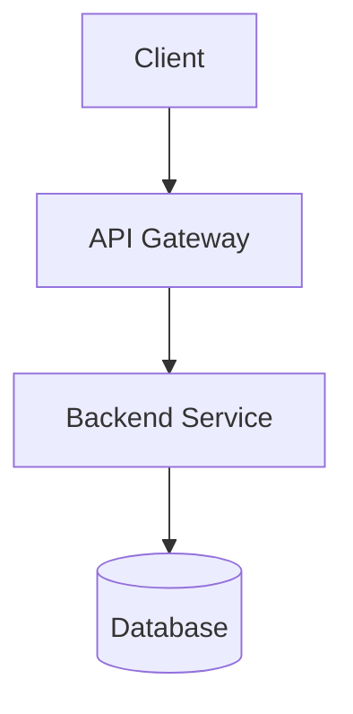

# /blueprint - Solution Architecture & Design

$ARGUMENTS: Feature name or business problem

## 🤖 Applied Agents: `business-architect`, `orchestrator` (Supreme Entity)

This workflow initiates a high-level design session to bridge business vision with technical reality.

## 🧠 Supreme Entity Integration

When `/blueprint` is triggered, the Supreme Entity applies 5W1H:

| Dimension | Analysis |
|-----------|----------|
| **WHAT** | User needs system design / architecture |
| **WHO** | `@business-architect` primary, domain specialists secondary |
| **HOW** | `architecture`, `c4-architecture`, `plan-writing`, `senior-architect`, `product-manager-toolkit` |
| **WHY** | Prevent technical debt, ensure scalability |


---

## 🛠️ Step-by-Step Execution

### Phase 1: Discovery & Goal Alignment
- Identify primary stakeholders and users
- Define the "Core Problem" being solved
- Map business goals to technical objectives
- Document demographic-specific constraints

### Phase 2: Functional Requirements
- Detail the "Must-haves" vs "Nice-to-haves"
- Define user flows and data interactions
- Create use case diagrams if needed
- Establish acceptance criteria

### Phase 3: Technical Blueprinting
- Propose architecture (Stack, DB Schema, Data flow)
- Create C4 diagrams (Context, Container, Component)
- Address feasibility, scalability, and technical debt
- Identify integration points

### Phase 4: Blueprint Verification
- Conduct feasibility audit
- Review with domain specialists
- Final approval checkpoint

---

## 🚦 Output Format

```markdown
## 🏗️ Blueprint: [Feature/System Name]

### Executive Summary
[1-2 sentence overview]

### Problem Statement
[What problem does this solve?]

### Stakeholders
| Role | Needs |
|------|-------|
| [User type] | [What they need] |

---

## Functional Requirements

### Must-Haves (MVP)
1. [Requirement 1]
2. [Requirement 2]

### Nice-to-Haves (V2)
1. [Enhancement 1]

---

## Technical Architecture

### Stack Recommendation
| Layer | Technology | Rationale |
|-------|------------|-----------|
| Frontend | [Tech] | [Why] |
| Backend | [Tech] | [Why] |
| Database | [Tech] | [Why] |

### System Diagram


### Data Flow
[Describe key data flows]

---

## Implementation Roadmap

| Phase | Deliverable | Effort |
|-------|-------------|--------|
| 1 | [Core feature] | [X days] |
| 2 | [Enhancement] | [Y days] |

---

## Risks & Mitigations

| Risk | Impact | Mitigation |
|------|--------|------------|
| [Risk 1] | High/Medium/Low | [Strategy] |

---

## Next Steps
- [ ] `/plan` to create detailed tasks
- [ ] `/create` to begin implementation
```

---

## 🔗 Workflow Chaining

| After Blueprint | Next Workflow |
|-----------------|---------------|
| Approved design | `/plan` |
| Multi-domain complexity | `/orchestrate` |
| Security-critical | `/secure-audit` |
| Performance-critical | `/optimize-stack` |

---

## Examples

```
/blueprint e-commerce checkout system
/blueprint real-time notification service
/blueprint mobile authentication flow
/blueprint multi-tenant SaaS architecture
```

---

## Key Principles

- **Business-first** — Start with user needs, not technology
- **Visual** — Use diagrams for complex systems
- **Pragmatic** — Balance ideal vs. feasible
- **Iterative** — Blueprint can evolve with feedback
